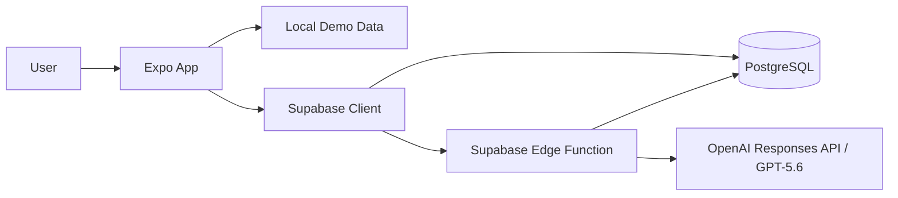

# Clawback Technical Architecture

## 1. Architecture Goals

The architecture should optimize for:

1. A reliable hackathon demo
2. Clear security boundaries
3. iOS and web compatibility
4. Fast iteration with Codex
5. Testable business logic
6. Minimal infrastructure
7. A credible path to production without premature complexity

## 2. System Overview



The Expo application is responsible for presentation, navigation, local interaction state, and calling typed service interfaces.

Supabase is responsible for authentication, persistence, Row Level Security, and server-side AI invocation.

GPT-5.6 is responsible only for converting unstructured email text into a constrained structured extraction. It does not directly mutate user data.

## 3. Platform Strategy

Clawback uses one Expo codebase.

Primary platform:

- iOS Simulator and mobile layout

Judge-friendly platform:

- Expo Web deployment

The application must preserve core behavior on both platforms. Mobile-specific enhancements such as haptics must degrade gracefully on web.

## 4. Proposed Repository Structure

```text
app/
  _layout.tsx
  (tabs)/
    _layout.tsx
    index.tsx
    activity.tsx
  add/
    index.tsx
    manual.tsx
    email.tsx
    review.tsx
  item/
    [id].tsx

components/
  AppHeader.tsx
  EmptyState.tsx
  ErrorState.tsx
  LoadingState.tsx
  MetricCard.tsx
  Screen.tsx

features/
  financial-items/
    components/
      FinancialItemCard.tsx
      FinancialItemList.tsx
      SwipeToStrike.tsx
      UrgencyBadge.tsx
    hooks/
      useFinancialItems.ts
    logic/
      calculateMetrics.ts
      rankFinancialItems.ts
      statusTransitions.ts
    types.ts
  email-parser/
    components/
      EmailInputForm.tsx
      ExtractionReviewForm.tsx
    schema.ts
    types.ts

hooks/
  useReducedMotion.ts
  useToast.ts

lib/
  dates.ts
  money.ts
  urls.ts
  validation.ts
  supabase.ts

services/
  financialItemsService.ts
  emailParserService.ts

constants/
  demoData.ts
  theme.ts

types/
  database.ts
  navigation.ts

supabase/
  migrations/
  functions/
    parse-financial-email/
      index.ts
      prompt.ts
      schema.ts

docs/
tests/
```

The actual structure may be adjusted as implementation reveals better boundaries. Avoid empty folders and unnecessary indirection.

## 5. Frontend Responsibilities

The Expo client owns:

- Navigation
- Form state
- Display formatting
- Swipe and completion interactions
- Optimistic UI when safe
- Accessibility behavior
- Calling typed services
- Demo mode
- Loading and error presentation

The client must not own:

- OpenAI credentials
- Raw model invocation
- Authorization-bypassing database operations
- Trust decisions about unvalidated AI output

## 6. Backend Responsibilities

Supabase owns:

- User identity
- Persistent financial items
- Row Level Security
- Server-side email parsing
- Request validation
- Model invocation
- Normalized extraction response
- Optional audit metadata

## 7. Data Model

### `financial_items`

| Column | Type | Notes |
|---|---|---|
| `id` | UUID | Primary key |
| `user_id` | UUID | Owner |
| `kind` | TEXT or enum | `trial`, `perk`, `subscription` |
| `title` | TEXT | Required |
| `provider` | TEXT | Optional |
| `value_cents` | INTEGER | Benefit value |
| `charge_amount_cents` | INTEGER | Potential charge |
| `due_at` | TIMESTAMPTZ | Required for active actionable tasks |
| `recurrence` | TEXT or enum | `none`, `monthly`, `quarterly`, `annual`, `custom` |
| `action_url` | TEXT | Validated external URL |
| `status` | TEXT or enum | `active`, `completed`, `expired` |
| `source` | TEXT or enum | `manual`, `email`, `demo` |
| `extraction_confidence` | NUMERIC | Nullable, 0 to 1 |
| `source_metadata` | JSONB | Minimal provenance, no unnecessary raw content |
| `created_at` | TIMESTAMPTZ | Server default |
| `updated_at` | TIMESTAMPTZ | Server maintained |
| `completed_at` | TIMESTAMPTZ | Nullable |

### Optional `email_extractions`

This table is not required for the initial MVP.

Add it only if the product needs persisted draft extractions or debugging metadata.

Possible fields:

- `id`
- `user_id`
- `financial_item_id`
- `status`
- `confidence`
- `evidence`
- `created_at`

Avoid storing full email content by default.

## 8. TypeScript Domain Types

```ts
export type FinancialItemKind = "trial" | "perk" | "subscription";

export type FinancialItemStatus = "active" | "completed" | "expired";

export type FinancialItemSource = "manual" | "email" | "demo";

export type Recurrence =
  | "none"
  | "monthly"
  | "quarterly"
  | "annual"
  | "custom";

export interface FinancialItem {
  id: string;
  userId: string | null;
  kind: FinancialItemKind;
  title: string;
  provider: string | null;
  valueCents: number | null;
  chargeAmountCents: number | null;
  dueAt: string;
  recurrence: Recurrence;
  actionUrl: string | null;
  status: FinancialItemStatus;
  source: FinancialItemSource;
  extractionConfidence: number | null;
  createdAt: string;
  updatedAt: string;
  completedAt: string | null;
}
```

Runtime validation must still be applied to network and AI payloads.

## 9. Service Layer

### `financialItemsService`

Expected operations:

```ts
listActiveItems(): Promise<FinancialItem[]>
getItem(id: string): Promise<FinancialItem>
createItem(input: CreateFinancialItemInput): Promise<FinancialItem>
updateItem(id: string, input: UpdateFinancialItemInput): Promise<FinancialItem>
completeItem(id: string): Promise<FinancialItem>
restoreItem(id: string): Promise<FinancialItem>
```

The UI should consume the service interface rather than embedding Supabase queries in components.

### `emailParserService`

Expected operation:

```ts
parseFinancialEmail(input: {
  emailText: string;
  userTimeZone: string;
  referenceDate: string;
}): Promise<FinancialEmailExtraction>
```

This service calls the Supabase Edge Function.

## 10. AI Edge Function Contract

### Endpoint

`parse-financial-email`

### Request

```json
{
  "emailText": "string",
  "userTimeZone": "America/New_York",
  "referenceDate": "2026-07-16"
}
```

### Response

```json
{
  "provider": "FoundersCard",
  "title": "Cancel FoundersCard trial",
  "kind": "trial",
  "valueCents": null,
  "chargeAmountCents": 59500,
  "dueAt": "2026-07-20T23:59:00-04:00",
  "recurrence": "annual",
  "actionUrl": "https://example.com/account",
  "confidence": 0.91,
  "needsReview": true,
  "warnings": [],
  "evidence": {
    "provider": "FoundersCard",
    "chargeAmount": "$595 annual membership",
    "deadline": "Cancel before July 21"
  }
}
```

All fields must be validated server-side before returning to the client.

## 11. Authentication Strategy

### Hackathon Default

Prefer the simplest reliable approach:

- Demo mode with local data
- Optional anonymous or email-based Supabase authentication
- No authentication requirement for viewing the seeded demo

The AI Edge Function may require an authenticated Supabase session in the full implementation. If this threatens demo reliability, a controlled demo endpoint with rate limiting and no persistent raw email storage may be used.

The final approach must be recorded in `DECISIONS.md`.

## 12. Row Level Security

Every user-owned table must enable RLS.

Conceptual policies:

```sql
create policy "Users can read own financial items"
on financial_items
for select
using (auth.uid() = user_id);

create policy "Users can create own financial items"
on financial_items
for insert
with check (auth.uid() = user_id);

create policy "Users can update own financial items"
on financial_items
for update
using (auth.uid() = user_id)
with check (auth.uid() = user_id);

create policy "Users can delete own financial items"
on financial_items
for delete
using (auth.uid() = user_id);
```

Exact SQL should be implemented and tested in migrations.

## 13. State Management

### Local UI State

Use local component state for:

- Form inputs
- Expanded cards
- Temporary Undo state
- Modal visibility
- Parsing progress

### Shared Application State

Use a focused provider or custom hook only for:

- Current user/session
- Demo mode
- Financial item collection when shared across routes

Do not add a broad state-management library during the MVP unless a concrete need appears.

### Server State

Keep fetching and mutations behind focused hooks and services.

The project may add a query library only if caching and mutation complexity justify it.

## 14. Demo Mode

Demo mode is a first-class reliability feature.

Requirements:

- Loads local seeded tasks
- Does not require credentials
- Supports completion and Undo locally
- Can be reset
- Clearly indicates that data is sample data
- Uses the same domain types and business logic as persisted data

Avoid building a completely separate UI path for demo mode.

## 15. Business Logic

Pure functions should implement:

- Currency totals
- Deadline proximity
- Urgency labels
- Ranking score
- Completion transitions
- Recurrence label formatting

These functions should be unit tested and must not depend on React or Supabase.

## 16. Date and Time Handling

- Store persistent dates as ISO 8601 timestamps.
- Preserve timezone information where known.
- Pass a reference date and user timezone to the AI parser.
- Avoid parsing ambiguous natural-language dates only on the client.
- Display deadlines in the user's locale.
- Test month-end, quarter-end, year-end, and daylight-saving boundaries.
- Use future dates in demo data.

## 17. Currency Handling

- Store money in integer cents.
- Do not use floating-point values for arithmetic.
- Format money only at the presentation layer.
- Support zero and null distinctly.
- Do not imply guaranteed savings.

## 18. URL Handling

Before opening an action URL:

- Parse the URL
- Allow only `https` by default
- Optionally allow `http` only in local development
- Reject malformed values
- Show the destination domain when practical
- Require user action before opening

The AI parser must return `null` when no URL is present.

## 19. Error Strategy

### Client Errors

Display actionable messages:

- Could not load tasks
- Could not save task
- Could not parse email
- Invalid action link
- Session expired

### AI Errors

Possible categories:

- Network failure
- Model timeout
- Invalid structured response
- Ambiguous date
- Missing required field
- Unsafe or oversized input

Offer manual entry as the universal fallback.

### Demo Resilience

The application should remain presentable with local demo data when Supabase or OpenAI is unavailable.

## 20. Logging and Observability

For the MVP:

- Log request IDs and error categories
- Do not log full email bodies
- Do not log tokens or secrets
- Avoid user-identifying financial content
- Use structured logs in Edge Functions where practical

A full analytics platform is out of scope.

## 21. Testing Strategy

### Unit Tests

- Metric calculation
- Ranking
- Deadline labels
- Money formatting
- URL validation
- Status transitions
- AI response schema validation

### Component Tests

Where practical:

- Task card rendering
- Complete and Undo behavior
- Extraction review validation

### Manual Tests

- iOS Simulator
- Mobile-width web
- Desktop-width web
- Reduced motion
- Missing values
- Invalid URL
- AI failure
- Empty dashboard

## 22. Deployment

### Web

Deploy the Expo web build to a judge-accessible host.

Potential hosts:

- Vercel
- Netlify
- Expo web-compatible deployment platform

### Supabase

Use a dedicated project with:

- Migrations committed
- RLS enabled
- Edge Function deployed
- Secrets stored server-side

### Mobile

The demo video may show the iOS Simulator. App Store submission is not required for the MVP.

## 23. Environment Variables

### Client

```text
EXPO_PUBLIC_SUPABASE_URL
EXPO_PUBLIC_SUPABASE_ANON_KEY
```

### Edge Function

```text
OPENAI_API_KEY
OPENAI_MODEL
```

No secret may use the `EXPO_PUBLIC_` prefix.

## 24. Security Review Checklist

Before submission:

- Search Git history for secrets
- Confirm `.env` files are ignored
- Confirm RLS is enabled
- Confirm service-role key is absent from client code
- Confirm OpenAI key exists only server-side
- Confirm raw emails are not logged
- Confirm URLs are validated
- Confirm error messages do not leak sensitive data
- Confirm demo credentials, if any, are limited

## 25. Architecture Non-Goals

Do not add during the hackathon unless required:

- Microservices
- Message queues
- Custom backend server
- Event sourcing
- Complex domain-driven architecture
- Multiple databases
- Offline sync engine
- Native modules
- Full notification platform
