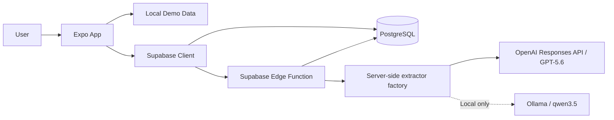

# Clawback Technical Architecture

## 1. Architecture Goals

The architecture should optimize for:

1. A reliable hackathon demo
2. Clear security boundaries
3. iOS and web compatibility
4. Fast iteration with Codex
5. Testable business logic
6. Minimal infrastructure
7. A credible path to production without premature complexity

## 2. System Overview



The Expo application is responsible for presentation, navigation, local interaction state, and calling typed service interfaces.

Supabase is responsible for authentication, persistence, Row Level Security, and server-side AI invocation.

GPT-5.6 is the hosted and judge-ready extractor. Ollama is an optional local
development extractor. Both convert unstructured email text into the same
constrained draft, and neither directly mutates user data.

## 3. Platform Strategy

Clawback uses one Expo codebase.

Primary platform:

- iOS Simulator and mobile layout

Judge-friendly platform:

- Expo Web deployment

The application must preserve core behavior on both platforms. Mobile-specific enhancements such as haptics must degrade gracefully on web.

## 4. Proposed Repository Structure

```text
app/
  _layout.tsx
  (tabs)/
    _layout.tsx
    index.tsx
    activity.tsx
  add/
    index.tsx
    manual.tsx
    email.tsx
  item/
    [id].tsx

components/
  AppHeader.tsx
  EmptyState.tsx
  ErrorState.tsx
  LoadingState.tsx
  MetricCard.tsx
  Screen.tsx

features/
  financial-items/
    components/
      FinancialItemCard.tsx
      FinancialItemList.tsx
      SwipeToStrike.tsx
      UrgencyBadge.tsx
    hooks/
      useFinancialItems.ts
    logic/
      calculateMetrics.ts
      rankFinancialItems.ts
      statusTransitions.ts
    types.ts
  email-parser/
    components/
      EmailInputForm.tsx
      ExtractionReviewForm.tsx
    schema.ts
    types.ts

hooks/
  useReducedMotion.ts
  useToast.ts

lib/
  dates.ts
  money.ts
  urls.ts
  validation.ts
  supabase.ts

services/
  financialItemsService.ts
  emailParserService.ts

constants/
  demoData.ts
  theme.ts

types/
  database.ts
  navigation.ts

supabase/
  migrations/
  functions/
    parse-financial-email/
      index.ts
      prompt.ts
      schema.ts

docs/
tests/
```

The pasted-email input, extraction lifecycle, candidate edits, warnings, and
errors remain local to `app/add/email.tsx` and its route-local workflow hook.
The route never places raw email or extracted fields in URL parameters,
navigation history, application-wide provider state, or persistent storage.
Only an explicitly reviewed financial item enters `FinancialItemsProvider`.

The actual structure may be adjusted as implementation reveals better boundaries. Avoid empty folders and unnecessary indirection.

## 5. Frontend Responsibilities

The Expo client owns:

- Navigation
- Form state
- Display formatting
- Swipe and completion interactions
- Optimistic UI when safe
- Accessibility behavior
- Calling typed services
- Demo mode
- Loading and error presentation

The client must not own:

- OpenAI credentials
- Raw model invocation
- Authorization-bypassing database operations
- Trust decisions about unvalidated AI output

### Accessibility focus boundary

`AccessibilityFocusProvider` is a presentation-only root context. The active
route registers one page-heading focus callback; transient status producers can
request that target or emit a bounded assistive announcement. It stores no
financial item, form value, route payload, authentication state, or durable
preference. It does not change repository mutations or navigation decisions.

Validation remains owned by the existing manual-entry and AI-review validators.
Components receive an incrementing presentation request after failed
validation, derive the first invalid field from the shared visible field order,
and focus that existing control. Web label/error IDs and native accessibility
hints describe the same validator output without creating a second validation
contract.

## 6. Backend Responsibilities

Supabase owns:

- User identity
- Persistent financial items
- Row Level Security
- Server-side email parsing
- Request validation
- Model invocation
- Normalized extraction response
- Optional audit metadata

## 7. Data Model

### `financial_items`

| Column | Type | Notes |
|---|---|---|
| `id` | UUID | Primary key |
| `user_id` | UUID | Owner |
| `kind` | TEXT or enum | `trial`, `perk`, `subscription` |
| `title` | TEXT | Required |
| `provider` | TEXT | Optional |
| `value_cents` | INTEGER | Benefit value |
| `charge_amount_cents` | INTEGER | Potential charge |
| `due_at` | TIMESTAMPTZ | Required for active actionable tasks |
| `recurrence` | TEXT or enum | `none`, `monthly`, `quarterly`, `annual`, `custom` |
| `action_url` | TEXT | Validated external URL |
| `status` | TEXT or enum | `active`, `completed`, `expired` |
| `source` | TEXT or enum | `manual`, `email`, `demo` |
| `extraction_confidence` | NUMERIC | Nullable, 0 to 1 |
| `source_metadata` | JSONB | Minimal provenance, no unnecessary raw content |
| `created_at` | TIMESTAMPTZ | Server default |
| `updated_at` | TIMESTAMPTZ | Server maintained |
| `completed_at` | TIMESTAMPTZ | Nullable |

### Optional `email_extractions`

This table is not required for the initial MVP.

Add it only if the product needs persisted draft extractions or debugging metadata.

Possible fields:

- `id`
- `user_id`
- `financial_item_id`
- `status`
- `confidence`
- `evidence`
- `created_at`

Avoid storing full email content by default.

### `financial_email_extraction_usage`

This narrowly scoped table backs the atomic per-user extraction limit. Its
primary key is `(user_id, window_started_at)`. RLS is enabled, clients receive
no direct table privileges, and the only supported access path is the
parameterless authenticated claim function.

## 8. TypeScript Domain Types

```ts
export type FinancialItemKind = "trial" | "perk" | "subscription";

export type FinancialItemStatus = "active" | "completed" | "expired";

export type FinancialItemSource = "manual" | "email" | "demo";

export type Recurrence =
  | "none"
  | "monthly"
  | "quarterly"
  | "annual"
  | "custom";

export interface FinancialItem {
  id: string;
  userId: string | null;
  kind: FinancialItemKind;
  title: string;
  provider: string | null;
  valueCents: number | null;
  chargeAmountCents: number | null;
  dueAt: string;
  recurrence: Recurrence;
  actionUrl: string | null;
  status: FinancialItemStatus;
  source: FinancialItemSource;
  extractionConfidence: number | null;
  createdAt: string;
  updatedAt: string;
  completedAt: string | null;
}
```

Runtime validation must still be applied to network and AI payloads.

## 9. Service Layer

### `financialItemsService`

Checkpoint 4A defines one asynchronous `FinancialItemsRepository` contract with
local and Supabase implementations:

```ts
listItems(): Promise<FinancialItem[]>
getItem(id: string): Promise<FinancialItem | null>
createItem(input: CreateFinancialItemInput): Promise<FinancialItem>
updateItem(id: string, input: UpdateFinancialItemInput): Promise<FinancialItem | null>
completeItem(id: string): Promise<FinancialItem | null>
restoreItem(id: string): Promise<FinancialItem | null>
deleteItem(id: string): Promise<boolean>
ensureInitialSeed(referenceDate?: Date): Promise<void>
```

The UI consumes this service interface rather than embedding Supabase queries
in components. The provider is the sole visible state authority: it selects the
repository during initialization, exposes explicit loading and failure phases,
and applies only repository-confirmed mutations to visible state.

Create, complete, and restore operations are pessimistic. Provider-owned
synchronous guards prevent duplicate pending writes, and normalized mutation
errors expose only the operation, optional item ID, user-safe message, and
dismiss behavior. Initialization and mutation generation tokens prevent stale
responses from overwriting newer successful state.

### `emailParserService`

Expected operation:

```ts
parseFinancialEmail(input: {
  emailText: string;
  subject?: string;
  userTimeZone: string;
  referenceDate: string;
}): Promise<FinancialEmailExtraction>
```

This service calls the Supabase Edge Function with the current authenticated
client. It strictly validates the provider-neutral response and maps server
codes to user-safe client errors. `rate_limited` includes a bounded
`retryAfterSeconds`; lifecycle aborts have a separate type and are not rendered
as provider failures. The locale-independent `referenceDate` is assembled from
Gregorian, Latin-digit `Intl.DateTimeFormat.formatToParts()` output in the
resolved device IANA timezone.

## 10. AI Edge Function Contract

### Endpoint

`parse-financial-email`

### Request

```json
{
  "emailText": "string",
  "subject": "Your renewal reminder",
  "emailSentDate": "2026-07-15",
  "userTimeZone": "America/New_York",
  "referenceDate": "2026-07-16"
}
```

### Response

```json
{
  "ok": true,
  "extraction": {
    "isActionable": true,
    "candidate": {
      "merchantName": "FoundersCard",
      "title": "Cancel FoundersCard trial",
      "kind": "trial",
      "valueCents": null,
      "chargeAmountCents": 59500,
      "deadlineDate": "2026-07-20",
      "recurrence": "annual",
      "actionUrl": "https://example.com/account"
    },
    "confidence": 0.91,
    "warnings": []
  }
}
```

Models generate decimal money strings; the Edge Function validates and converts
them to integer cents before returning this response. `merchantName` maps to the
existing `FinancialItem.provider` only when the user reviews and saves. Evidence
and raw email content are not returned, logged, or persisted. Mandatory review
is application policy rather than a model-generated flag.

### Extractor Interface

```ts
interface FinancialEmailExtractor {
  extract(
    emailText: string,
    context: ExtractionContext,
  ): Promise<GeneratedFinancialEmailExtraction>;
}
```

`OpenAIEmailExtractor` and `OllamaEmailExtractor` implement this contract.
Provider selection is resolved exclusively from Edge Function environment
variables. The client cannot request a provider or model.

## 11. Authentication Strategy

### Connected and Demo Modes

- Connected mode creates or restores a persisted Supabase anonymous session.
- Every connected user receives a unique Auth user ID, which owns all of that
  user's rows.
- RLS policies apply to `authenticated` and require
  `auth.uid() = user_id` for every operation.
- Missing Supabase variables select credential-free local demo mode. Partial or
  unsafe configuration is an error, not a demo-mode fallback.
- Email/password, OAuth, profiles, and account-upgrade UI are out of scope.

This decision is recorded in `DECISIONS.md`.

## 12. Row Level Security

Every user-owned table must enable RLS.

Conceptual policies:

```sql
create policy "Users can read own financial items"
on financial_items
for select
using (auth.uid() = user_id);

create policy "Users can create own manual or email financial items"
on financial_items
for insert
with check (
  auth.uid() = user_id
  and source in ('manual', 'email')
);

create policy "Users can update own financial items"
on financial_items
for update
using (auth.uid() = user_id)
with check (auth.uid() = user_id);

create policy "Users can delete own financial items"
on financial_items
for delete
using (auth.uid() = user_id);
```

Exact SQL should be implemented and tested in migrations.

The exported repository creation type permits only `source: manual` with null
confidence or `source: email` with validated confidence. Source and confidence
are immutable after creation. Direct authenticated inserts cannot create
`source: demo` rows.

The fixed one-time bootstrap is the deliberate narrow exception: a
parameterless `SECURITY DEFINER` function derives the owner only from
`auth.uid()`, uses a locked search path and schema-qualified relations, and
inserts only the three version-controlled sample descriptors. It accepts no
owner, source, title, amount, date, or arbitrary payload. Execute is revoked
from `PUBLIC` and `anon` and granted only to `authenticated`. The marker and
fixed inserts remain transactional and repeated calls never reinsert changed
or deleted seed rows.

The extraction rate-limit table has RLS enabled but no direct authenticated
table grants. A `SECURITY DEFINER`, parameterless function derives
`auth.uid()` and atomically claims one of 20 slots in the current UTC hour.

## 13. State Management

### Local UI State

Use local component state for:

- Form inputs
- Expanded cards
- Temporary Undo state
- Modal visibility
- Parsing progress

`FinancialItemsProvider` also owns one transient, in-memory indication that a
successful create or completion occurred during the mounted application
session. Together with a pure comparison against `createDemoItems`, it controls
the pristine Home explanation. The comparison ignores generated identity and
timestamp metadata, is independent of row order, and is evaluated only after a
complete successful load. Undo and initialization retry do not clear the
session indication. It is never written to browser storage, Supabase, route
state, or another durable preference. Checkpoint 6B's explicit Local-demo
reset is the only operation that may restore canonical data and clear the
indication together.

Checkpoint 6B implements reset as a Local-only provider transition. The
provider refuses reset while a create, complete, or restore write is in flight,
while initialization is active, or while another reset is active. Initialization
also refuses to start during reset. The Add UI disables reset for known pending
create, complete, restore, and reset state, while these provider refs remain
authoritative. The provider constructs a fresh local repository with its
reference date, loads and validates the canonical `createDemoItems` result
off-screen, and only then swaps the repository and visible collection together.
The same successful transition clears Undo, mutation presentation state, and
the session-interaction marker. If preparation fails, the existing repository,
items, derived presentation, Undo, errors, and marker remain unchanged.
Connected mode cannot enter this path and does not delete rows, release
authentication, clear storage, or replace the anonymous identity.

Manual entry and AI extraction review compose the same platform-specific
`DeadlineField`. Its form boundary accepts and emits only timezone-free
`YYYY-MM-DD` strings. Native picker values are constructed and reconstructed at
local noon with year/month/day round-trip validation; the existing manual and
review validators remain responsible for converting a confirmed calendar date
to the established UTC-noon `dueAt` representation. This changes no database,
repository, extraction, or API contract.

### Shared Application State

Use a focused provider or custom hook only for:

- Current user/session
- Demo mode
- Financial item collection when shared across routes

Do not add a broad state-management library during the MVP unless a concrete need appears.

### Server State

Keep fetching and mutations behind focused hooks and services.

The project may add a query library only if caching and mutation complexity justify it.

## 14. Demo Mode

Demo mode is a first-class reliability feature.

Requirements:

- Loads local seeded tasks
- Does not require credentials
- Supports completion and Undo locally
- Can be reset
- Clearly indicates that data is sample data
- Uses the same domain types and business logic as persisted data

Avoid building a completely separate UI path for demo mode.

## 15. Business Logic

Pure functions should implement:

- Currency totals
- Deadline proximity
- Urgency labels
- Ranking score
- Completion transitions
- Recurrence label formatting

These functions should be unit tested and must not depend on React or Supabase.

## 16. Date and Time Handling

- Store persistent dates as ISO 8601 timestamps.
- Milestone 04 converts date-only input to 12:00 UTC and converts persisted
  timestamps back to a UTC `YYYY-MM-DD` value through one shared date utility.
  This prevents platform-dependent date shifts during the MVP.
- Preserve timezone information where known.
- Pass a reference date and user timezone to the AI parser.
- Avoid parsing ambiguous natural-language dates only on the client.
- Display deadlines in the user's locale.
- Test month-end, quarter-end, year-end, and daylight-saving boundaries.
- Use future dates in demo data.

User-local timezone conversion remains deferred; noon UTC is a deterministic
testing and storage convention, not the final timezone design.

## 17. Currency Handling

- Store money in integer cents.
- Do not use floating-point values for arithmetic.
- Format money only at the presentation layer.
- Support zero and null distinctly.
- Do not imply guaranteed savings.

## 18. URL Handling

Before opening an action URL:

- Parse the URL
- Allow only `https` by default
- Optionally allow `http` only in local development
- Reject malformed values
- Show the destination domain when practical
- Require user action before opening

The AI parser must return `null` when no URL is present.

## 19. Error Strategy

### Client Errors

Display actionable messages:

- Could not load tasks
- Could not save task
- Could not parse email
- Invalid action link
- Session expired

### AI Errors

Possible categories:

- Network failure
- Model timeout
- Invalid structured response
- Ambiguous date
- Missing required field
- Unsafe or oversized input

Offer manual entry as the universal fallback.

### Demo Resilience

The application should remain presentable with local demo data when Supabase or OpenAI is unavailable.

## 20. Logging and Observability

For the MVP:

- Log request IDs and error categories
- Do not log full email bodies
- Do not log tokens or secrets
- Avoid user-identifying financial content
- Use structured logs in Edge Functions where practical

A full analytics platform is out of scope.

## 21. Testing Strategy

### Unit Tests

- Metric calculation
- Ranking
- Deadline labels
- Money formatting
- URL validation
- Status transitions
- AI response schema validation

### Component Tests

Where practical:

- Task card rendering
- Complete and Undo behavior
- Extraction review validation

### Manual Tests

- iOS Simulator
- Mobile-width web
- Desktop-width web
- Reduced motion
- Missing values
- Invalid URL
- AI failure
- Empty dashboard

## 22. Deployment

### Web

The judge-facing web build uses Expo Router's existing single-page output and
Netlify. `npx expo export --platform web` produces ignored output in `dist/`.
The root `netlify.toml` publishes that directory and applies one non-forced
`/*` rewrite to `/index.html` with status 200 so direct navigation and refresh
work for every application route while existing static assets continue to win.

Netlify receives only the public Supabase URL and publishable key at build time.
It hosts no server function and receives no OpenAI key, Supabase secret or
service-role key, JWT, database password, or AI-provider configuration.

The production HTTPS origin is added to
`AI_EXTRACTION_ALLOWED_ORIGINS` as one exact origin. Local development may keep
the separately approved `http://localhost:8081` origin. Wildcards, hostname
suffix matching, Netlify deploy-preview origins, and arbitrary origins remain
rejected. Changing only this hosted secret does not require an Edge Function
code deployment.

The Milestone 06 production origin is
`https://clawback-app-ai.netlify.app`. It is configured beside localhost as an
exact hosted secret value, not embedded in CORS source code.

Netlify deploys are atomic. A web rollback republishes the previous successful
deploy; source rollback uses a normal Git revert. Because deployment changes no
database schema or stored record, it requires no database rollback.

### Supabase

Use a dedicated project with:

- Migrations committed
- RLS enabled
- Edge Function deployed
- Secrets stored server-side

### Mobile

The demo video may show the iOS Simulator. App Store submission is not required for the MVP.

## 23. Environment Variables

### Client

```text
EXPO_PUBLIC_SUPABASE_URL
EXPO_PUBLIC_SUPABASE_PUBLISHABLE_KEY
```

### Edge Function

```text
AI_EXTRACTION_PROVIDER
AI_EXTRACTION_ALLOWED_ORIGINS
AI_EXTRACTION_TIMEOUT_MS
OPENAI_API_KEY
OPENAI_EXTRACTION_MODEL
OLLAMA_BASE_URL
OLLAMA_EXTRACTION_MODEL
```

No Edge Function variable may use the `EXPO_PUBLIC_` prefix. Hosted/judge mode
uses OpenAI with `gpt-5.6`; Ollama variables are for local development only.

The parse function disables gateway JWT verification only to let CORS
preflight complete. It handles allowed `OPTIONS` requests before authentication
and validates each `POST` bearer token through Supabase Auth `getUser()`. It
does not use a service-role key or trust decoded claims alone. Origins are
matched against an exact server-side allowlist and responses include
`Vary: Origin`.

## 24. Security Review Checklist

Before submission:

- Search Git history for secrets
- Confirm `.env` files are ignored
- Confirm RLS is enabled
- Confirm service-role key is absent from client code
- Confirm OpenAI key exists only server-side
- Confirm OpenAI requests set `store: false`
- Confirm hosted extraction uses GPT-5.6 and no silent provider fallback
- Confirm CORS uses exact origins and unauthenticated POST is denied
- Confirm the database-backed per-user extraction limit is active
- Confirm raw emails are not logged
- Confirm URLs are validated
- Confirm error messages do not leak sensitive data
- Confirm demo credentials, if any, are limited

## 25. Architecture Non-Goals

Do not add during the hackathon unless required:

- Microservices
- Message queues
- Custom backend server
- Event sourcing
- Complex domain-driven architecture
- Multiple databases
- Offline sync engine
- Native modules
- Full notification platform
